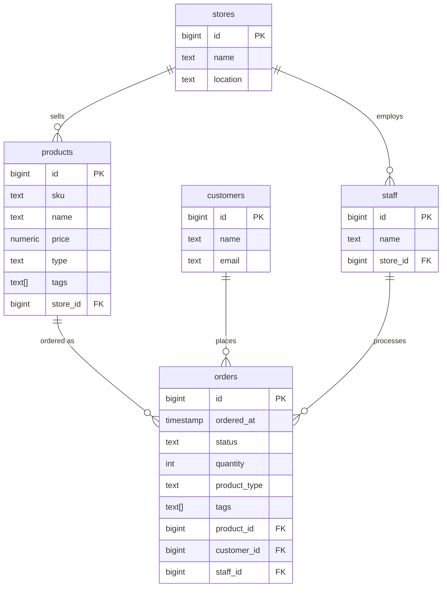

This repository demonstrates some of the concepts behind working with postgresql in production.

It contains a Docker environment with seed data and scripts that emulates a simple store that sells coffee online.

The aim is to demonstrate the following:
- Optimising queries
    - Indexes
    - Different types of joins
- Locking
    - mainly in the context of database migrations

## Data model



## Getting started

### Prerequisites

- Docker and Docker Compose

### Run

1. Build and start the container:

```bash
docker compose up -d
```

2. Shell into the container:

```bash
docker compose exec pg-demo bash
```

3. Run the schema migration:

```bash
psql -f /app/src/migrations/0001_init/migrate.sql
```

4. Seed the data (may take a few minutes depending on volume):

```bash
psql -f /app/src/migrations/0002_seed/migrate.sql
```

The seed script creates 5M orders across 95k customers by default. You can tweak these figures by editing the constants at the top of `src/migrations/0002_seed/migrate.sql`:

```sql
target_orders    constant int    := 5000000;
target_customers constant int    := 95000;
seed             constant float8 := 0.42;
```

The `seed` value controls PostgreSQL's `setseed()` — keeping it the same guarantees identical data across runs. At least 1M orders is recommended for the demos to show meaningful differences in `EXPLAIN ANALYZE`.

5. Connect to the database:

```bash
psql -U postgres -d coffee_store
```

### Stop

```bash
docker compose down
```

To also remove the database volume:

```bash
docker compose down -v
```
