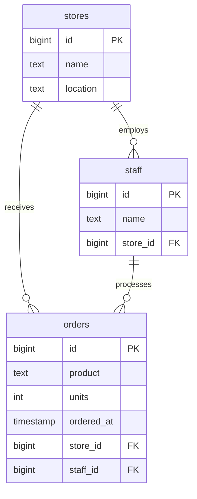

This section walks through the PostgreSQL primitives involved in setting up a database from scratch - databases, tables, schemas, roles, and a working application. Each numbered directory is a self-contained step with SQL files and a `README.md` explaining the concept.

## Data model



## Steps

| Step | Directory | Concept |
|------|-----------|---------|
| 1 | `0001_databases` | Creating a logical database |
| 2 | `0002_data` | Tables, sequences, views, materialised views |
| 3 | `0003_organisation` | Schemas - grouping objects, search path, grants |
| 4 | `0004_users` | Roles, login users, ownership, default privileges |
| 5 | `0005_app` | FastAPI app and role-specific scripts |

## Getting started

### Prerequisites

- Docker and Docker Compose
- Python 3.13+ and `uv` (for step 5)

### Run

1. Start the container (from repo root):

```bash
make up
```

2. Shell into the container (from repo root):

```bash
make dev
```

3. Create the `grocery_store` database:

```bash
psql -h localhost -U postgres -f src/configuration/0001_databases/run.sql
```

4. Apply steps 2–4 in order:

```bash
psql -h localhost -U postgres -d grocery_store -f src/configuration/0002_data/run.sql
psql -h localhost -U postgres -d grocery_store -f src/configuration/0003_organisation/run.sql
psql -h localhost -U postgres -d grocery_store -f src/configuration/0004_users/run.sql
```

5. Run the step 5 Python setup from `src/configuration/0005_app/src` (on the host):

```bash
uv sync
uv run python scripts/setup.py
```

### Connect to the database

From `src/configuration/` - connects as `postgres` by default:

```bash
make sql
```

Connect as a specific user:

```bash
make sql USER=application PASSWORD=pg
make sql USER=reporting PASSWORD=pg
make sql USER=developer_ro PASSWORD=pg
```

### Stop

From repo root:

```bash
make down
```

To also remove the database volume:

```bash
make wipe
```

> **Note on roles:** Roles are cluster-level objects - they live on the PostgreSQL server, not inside `grocery_store`. Dropping the database removes all tables, schemas, and data but leaves roles intact. To clean up roles, run `0004_users/reverse.sql` before dropping the database, or drop roles manually afterwards.

## Reverting

Each step has a `reverse.sql` (or `wipe_setup.py` for step 5). Run in reverse order:

```bash
# on the host
uv run python scripts/wipe_setup.py

psql -h localhost -U postgres -d grocery_store -f src/configuration/0004_users/reverse.sql
psql -h localhost -U postgres -d grocery_store -f src/configuration/0003_organisation/reverse.sql
psql -h localhost -U postgres -d grocery_store -f src/configuration/0002_data/reverse.sql
psql -h localhost -U postgres -f src/configuration/0001_databases/reverse.sql
```
